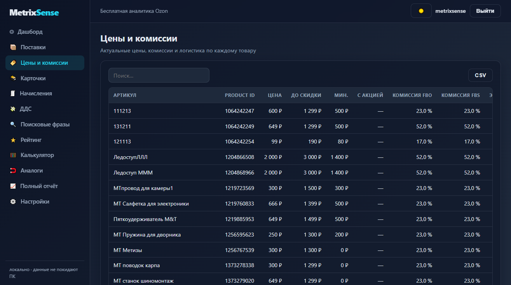
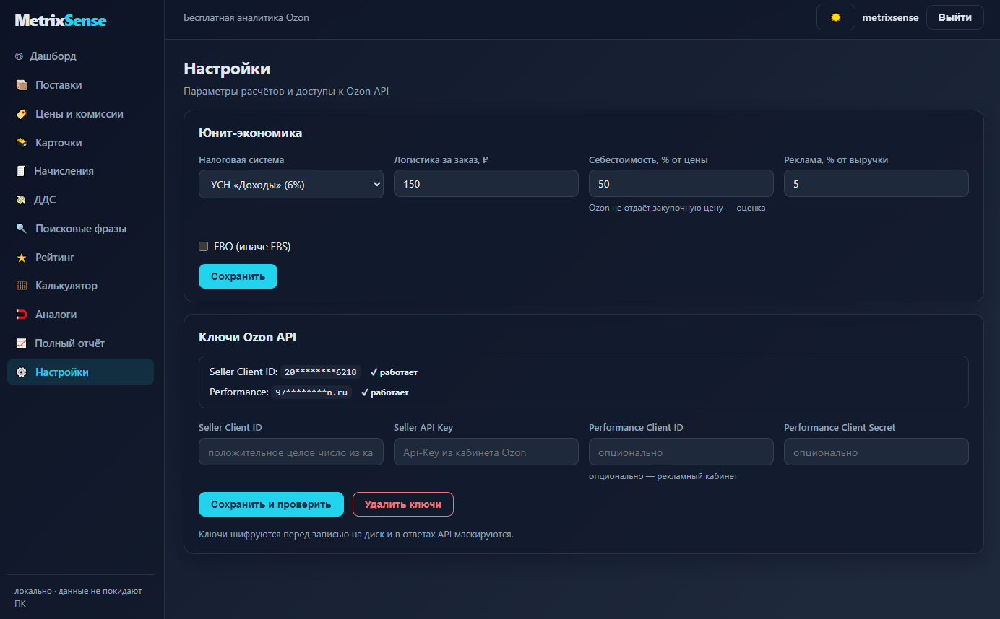

<div align="center">

# 📊 MetrixSense

**Бесплатная аналитика для продавцов Ozon — локально, из коробки, без подписок**

[](https://github.com/USElessOFF/metrixsense-ozon-toolkit/releases)
[](https://github.com/USElessOFF/metrixsense-ozon-toolkit/actions/workflows/ci.yml)
[](LICENSE)
[](backend/requirements.txt)
[](ruff.toml)
[](#-безопасность-и-приватность)
[](#-участие-в-проекте)

Открытая альтернатива платным сервисам: метрики магазина Ozon, юнит-экономика
и планирование поставок — **на вашем компьютере**. Данные не покидают вашу
машину: SQLite, локальный запуск, никаких облаков и подписок.


<p>
  
  
</p>

<a href="https://github.com/USElessOFF/metrixsense-ozon-toolkit/graphs/contributors">
  
</a>

</div>

---

## 💡 Почему MetrixSense

- **Бесплатно навсегда.** Подписки аналитических сервисов стоят от нескольких тысяч
  рублей в месяц. Здесь — ничего платить не нужно, код открыт под MIT.
- **Данные остаются у вас.** API-ключи и история продаж хранятся в локальной SQLite.
  Ни телеметрии, ни облаков — можно отключить интернет после настройки.
- **Из коробки.** Один скрипт установки — и веб-интерфейс работает на вашей машине.
  Node.js и прочие инструменты разработки не нужны: сборка интерфейса уже в репозитории.
- **Прозрачность.** Весь код на виду: можно проверить, куда уходят ваши ключи
  (в никуда), и как считается маржа.

## ✨ Возможности

- 🎯 **Дашборд «что делать»** — приоритетные действия по магазину: докупить товар,
  распродать мёртвый сток, пересмотреть дорогие расходы
- 📦 **Секции аналитики** — цены и комиссии, карточки товаров, финансовые начисления,
  рейтинг продавца, ДДС-журнал, поисковые фразы — каждый блок открывается отдельно
- 📈 **Планирование поставок** — дни запаса, IDC Ozon, разбивка по складам,
  рекомендуемая поставка
- 💰 **Юнит-экономика** — калькулятор маржи с налогами (УСН 6%, УСН «доходы − расходы»),
  логистикой и рекламным бюджетом; для новинок и товаров из вашего каталога
- 🔎 **Поиск аналогов** — похожие товары каталога по TF-IDF близости названий
- 📤 **Экспорт** — CSV из любой таблицы (открывается в Excel) + Excel-файл полного отчёта
- 🧩 **Расширение для Chrome** — аналитика прямо на страницах Ozon

## 🚀 Быстрый старт

### Windows — Docker (рекомендуется)

Одна команда в PowerShell — скрипт сам поставит WSL2 и Docker Desktop (тихо),
попросит одну перезагрузку, затем скачает и запустит MetrixSense:

```powershell
irm https://raw.githubusercontent.com/USElessOFF/metrixsense-ozon-toolkit/main/install_windows_docker.ps1 | iex
```

> Понадобятся права администратора и **одна перезагрузка**. Docker Desktop
> бесплатен для личного использования и малого бизнеса (< 250 сотрудников).
> После перезагрузки установка продолжится автоматически.

### Windows — без Docker и WSL2 (нативно)

Один процесс Python, ничего лишнего:

```powershell
irm https://raw.githubusercontent.com/USElessOFF/metrixsense-ozon-toolkit/main/install_windows.ps1 | iex
```

### Linux

```bash
curl -fsSL https://raw.githubusercontent.com/USElessOFF/metrixsense-ozon-toolkit/main/install_linux.sh | bash
```

### Ручная установка (любая ОС)

```bash
git clone https://github.com/USElessOFF/metrixsense-ozon-toolkit.git
cd metrixsense-ozon-toolkit

python -m venv .venv
# Windows:  .venv\Scripts\pip install -r backend\requirements.txt
# Linux/macOS:
source .venv/bin/activate
pip install -r backend/requirements.txt

uvicorn backend.app.main:app --host 127.0.0.1 --port 8000
```

Или через Docker: `docker compose up -d --build` → http://localhost:8080

### Куда смотреть после запуска

| URL | Что это |
|---|---|
| `http://localhost:8080` (Docker) или `http://127.0.0.1:8000` (нативно) | Веб-интерфейс |
| `/docs` | Интерактивная API-документация (Swagger UI) |
| `/health` | Проверка работоспособности |

## 🧭 Первые шаги

1. Откройте веб-интерфейс и войдите: **metrixsense / metrixsense**
   *(смените пароль — задайте `DEFAULT_PASSWORD` в `backend/.env`)*
2. Пройдите настройку магазина: вставьте ключи **Seller API**
   (Client ID + API key из личного кабинета Ozon) и нажмите «Проверить подключение».
   Performance API — опционально, для рекламных данных.
3. Сверьте параметры юнит-экономики: налоговая система, логистика,
   доля себестоимости, схема работы (FBO/FBS).
4. Готово — дашборд покажет, что требует внимания, а разделы в сайдбаре
   открываются независимо друг от друга.

Полный отчёт собирается в фоне: запустите на странице «Полный отчёт»
и возвращайтесь, когда статус станет «готов» — Excel-файл появится
в `backend/files/`.

## 🧩 Расширение для Chrome

1. Откройте `chrome://extensions`
2. Включите **Режим разработчика**
3. «Загрузить распакованное расширение» → папка `extension-metrixsense`
4. Убедитесь, что MetrixSense запущен — расширение работает с локальным бэкендом

## 🆘 Неполадки

| Проблема | Решение |
|---|---|
| Не входит с `metrixsense / metrixsense` | Учётная запись создаётся при первом запуске; проверьте `DEFAULT_USERNAME` / `DEFAULT_PASSWORD` в `backend/.env` |
| Порт 8000/8080 занят | Освободите порт или смените `PORT` в `backend/.env` / секцию `ports` в `docker-compose.yml` |
| SmartScreen / антивирус предупреждает | «Выполнить в любом случае». Скрипты скачивают только с github.com, python.org, docker.com |
| Лицензия Docker Desktop | Бесплатно для физлиц и бизнеса < 250 сотрудников и < $10M выручки. Иначе — нативный установщик |
| Docker: permission denied (Linux) | Перелогиньтесь после установки (группа docker) или используйте sudo |

## 🔐 Безопасность и приватность

- API-ключи Ozon **шифруются** перед записью на диск (ключ шифрования генерируется
  локально при первом запуске) и **маскируются** в ответах API.
- Все данные — продажи, расчёты, ключи — лежат в локальной SQLite
  (`backend/data/`) и никуда не отправляются.
- Сервер по умолчанию слушает только `127.0.0.1` — доступ есть только у вас.
- Аудит приветствуется: весь код открыт, зависимостей минимум.

## 🛠 Разработка

Backend (Python 3.12+):

```bash
pip install -r backend/requirements.txt
python -m pytest backend/tests -m "not live" -q   # тесты (live-тесты: pytest -m live)
ruff check backend                                 # линтер
uvicorn backend.app.main:app --reload              # dev-сервер
```

Frontend (Node.js 20.19+, только для изменений интерфейса —
пользователям сборка не нужна):

```bash
cd web
npm ci
npm run dev        # dev-сервер с прокси на localhost:8000
npm run check      # tsc + eslint
npm run build      # сборка в web/dist — коммитится в репозиторий
```

Подробности устройства — в [docs/ARCHITECTURE.md](docs/ARCHITECTURE.md).

## 🤝 Участие в проекте

PR-ы приветствуются: исправления, новые секции аналитики, i18n.
Идеи и планы живут в [Issues](https://github.com/USElessOFF/metrixsense-ozon-toolkit/issues) —
загляните туда перед крупными изменениями.

<!--
Аналитика репозитория (Repobeats): подключается за минуту на
https://repobeats.com — вставьте выданный  сюда.
-->

## 📄 Лицензия и дисклеймер

[MIT](LICENSE). MetrixSense **не аффилирован** с Ozon и не является официальным
продуктом компании. Использование API Ozon регулируется условиями вашей
аккредитации продавца.

